# Debugging: Alışveriş Sepeti Uygulaması

Bu proje, verilen bir **Alışveriş Sepeti Uygulaması** kodunda hata tespiti ve debugging yapılarak çalışabilir bir hale getirilmesini içermektedir.

## 1. Proje Amaç ve Açıklama

Bu proje, web geliştirme sürecinde yaygın olarak karşımıza çıkan **JavaScript hata ayıklama (debugging)** sürecini uygulamalı olarak deneyimlemek amacıyla yapılmıştır. Debug sürecinde **Chrome DevTools** kullanılmış ve hatalar giderilerek uygulamanın doğru çalışması sağlanmıştır.

## 2. Debugging Sürecinde Kullanılan Araçlar

* **Chrome DevTools - Sources Paneli**: Breakpoint koyarak kodun satır satır nasıl çalıştığını gözlemledim.
* **Step Over & Step Into**: Fonksiyonların içindeki değişkenlerin değerlerini canlı olarak kontrol ettim.
* **Call Stack İzleme**: Hata aldığımda fonksiyon çağırılarını takip ederek sorunun hangi aşamada oluştuğunu analiz ettim.
* **Watch Expressions & Scope**: Kodun belirli noktalarında değişkenlerin aldığı değerleri anlık olarak inceledim.

 **Bu sayede console.log() kullanmadan, doğrudan kodun çalışmasını izleyerek hataları tespit ettim.**

## 3. Debugging Metodolojisi
Bu projede hataları tespit etmek ve düzeltmek için aşağıdaki adımları takip ettim:

1. **Problemi Tespit Etme**: Uygulamayı kullanarak beklenmeyen davranışları gözlemledim
2. **Breakpoint Yerleştirme**: Şüpheli kod bölümlerine breakpoint'ler koydum
3. **Kod Çalıştırma**: Adım adım kodu çalıştırarak değişkenlerin değerlerini inceledim
4. **Hata Analizi**: Değişkenlerin değerlerini ve kod akışını analiz ederek hataları belirledim
5. **Düzeltme ve Test**: Hataları düzelttikten sonra uygulamayı test ederek düzeltmelerin başarılı olduğunu doğruladım

## 4. Tespit Edilen ve Çözülen Hatalar

### 4.1. Stok Kontrolü Hatası (`addItem` fonksiyonu)

#### Problem
`if (product.stock <= quantity)` şeklindeki kontrol, stok miktarı tam olarak istenilen miktara eşit olduğunda bile "Yetersiz stok!" hatası veriyordu. Bu, kullanıcıların stokta bulunan son ürünü sepete ekleyememelerine neden oluyordu.

#### Tespit Süreci
Bu problemi tespit etmek için:
1. `addItem` fonksiyonuna bir breakpoint yerleştirdim
2. Stokta tam 1 ürün kalan bir ürünü sepete eklemeye çalıştım
3. Kodun çalışması durduğunda, `product.stock` ve `quantity` değişkenlerinin değerlerini inceledim
4. `product.stock === quantity` olduğunda bile "Yetersiz stok!" hatası verildiğini gözlemledim

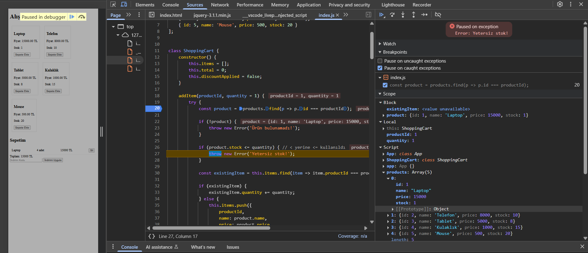

#### Çözüm
Kontrol ifadesini `if (product.stock < quantity)` olarak değiştirerek, stok miktarı tam olarak talep edilen miktara eşit olduğunda ürünün sepete eklenebilmesini sağladım.

```javascript
// Hatalı kod
if (product.stock <= quantity) { 
    throw new Error('Yetersiz stok!');
}

// Düzeltilmiş kod
if (product.stock < quantity) { 
    throw new Error('Yetersiz stok!');
}
```

### 4.2. Stok Azaltma Eksikliği (`addItem` fonksiyonu)

#### Problem
Ürün sepete eklendiğinde stok miktarı azaltılmıyordu. Bu, aynı ürünü stok miktarından daha fazla sayıda sepete eklemeye olanak veriyordu.

#### Tespit Süreci
1. `addItem` fonksiyonunun sonuna bir breakpoint koydum
2. Birkaç ürünü sepete ekledim
3. Her ekleme işleminden sonra `products` dizisindeki ilgili ürünün `stock` değerini kontrol ettim
4. Ürün eklense bile stok değerinin değişmediğini fark ettim

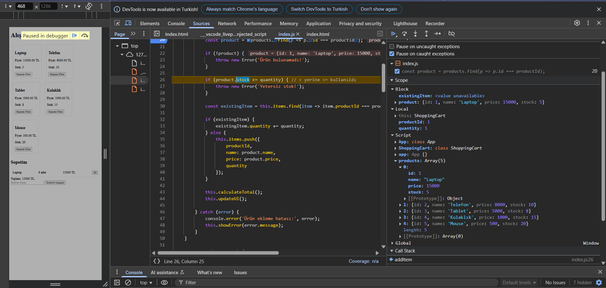

#### Çözüm
`addItem` fonksiyonuna `product.stock -= quantity;` satırını ekleyerek ürün sepete eklendiğinde stok miktarının güncellenmesini sağladım.

```javascript
// Eksik olan kod satırı
product.stock -= quantity;
```

### 4.3. Ürün Silme İşleminde Stok İade Hatası (`removeItem` fonksiyonu)

#### Problem
Sepetten ürün sildiğimizde, stoğa sadece tek bir ürün iade ediliyordu (`product.stock += 1`). Oysa sepette o üründen birden fazla olduğunda, silinen tüm ürünlerin stoğa geri eklenmesi gerekiyordu.

#### Tespit Süreci
1. `removeItem` fonksiyonuna bir breakpoint koydum
2. Önce sepete aynı üründen 2 adet ekledim
3. Sonra bu ürünleri sepetten sildim
4. `product.stock += 1` ifadesinin çalıştığını ve sadece 1 adet ürünün stoğa geri döndüğünü gözlemledim
5. Oysa sepette o üründen 2 adet vardı ve silme işleminde tüm ürünlerin stoğa geri döndürülmesi gerekiyordu

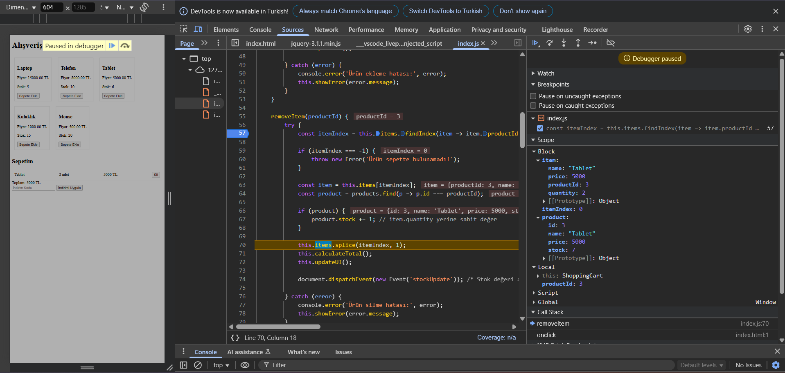
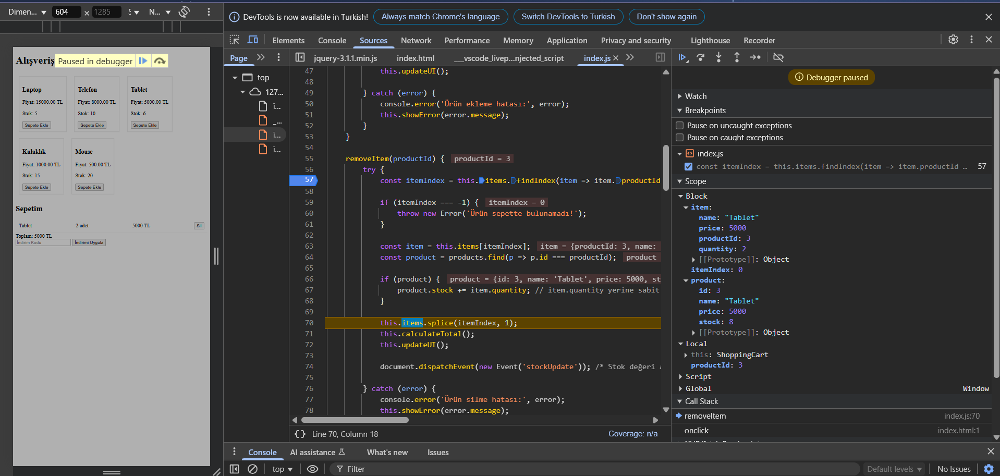

#### Çözüm
Sabit değer (1) yerine, sepetteki ürün miktarını kullanarak `product.stock += item.quantity;` şeklinde düzelttim. Böylece sepetten kaç adet ürün silinirse, stoğa da o kadar ürün geri ekleniyor.

```javascript
// Hatalı kod
product.stock += 1;

// Düzeltilmiş kod
product.stock += item.quantity;
```

### 4.4. Ürün Silme İşleminde UI Güncelleme Sorunu (`removeItem` fonksiyonu)

#### Problem
Sepetten ürün sildiğimizde stok değeri `products` dizisinde artıyor ancak kullanıcı arayüzünde görünmüyordu. Bu, kullanıcının güncel stok bilgisini görememesine neden oluyordu.

#### Tespit Süreci
Bu sorunu tespit etmek için çeşitli noktalara breakpoint'ler yerleştirdim:
1. `removeItem` fonksiyonunun başlangıcına (55-56. satır)
2. Stok güncelleme kısmına (67. satır, `product.stock += item.quantity;`)
3. `updateUI` fonksiyonuna (103. satır)
4. `App` sınıfındaki `renderProducts` fonksiyonuna

Breakpoint'ler ile adım adım ilerleyerek:
1. Sepetten bir ürün sildim (Tablet)
2. Debugger çalıştığında, `product.stock += item.quantity;` komutunun başarıyla çalıştığını ve stok değerinin arttığını gördüm
3. Scope panelinde, `product` nesnesinin içindeki `stock` değerinin düzgün şekilde güncellendiğini doğruladım
4. `updateUI` fonksiyonunun doğru çalıştığını gördüm, sepet içeriği ve toplam fiyat HTML içeriği düzgün oluşturuluyordu
5. Ancak UI'da ürün listesindeki stok miktarının güncellenmediğini fark ettim
6. `addToCart` fonksiyonunu incelediğimde, orada bir `document.dispatchEvent(new Event('stockUpdate'));` satırı olduğunu, ancak `removeItem` fonksiyonunda benzer bir çağrının olmadığını keşfettim

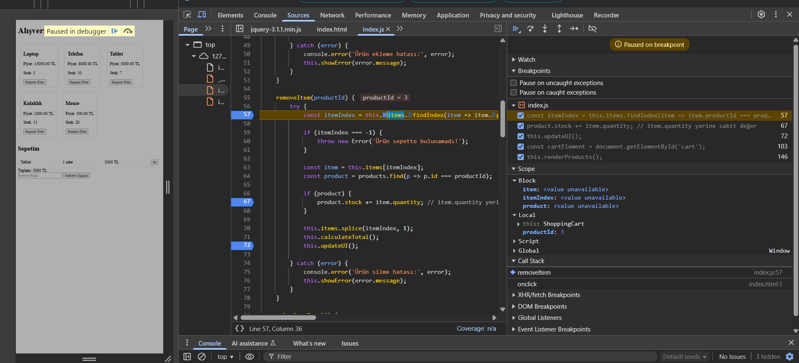
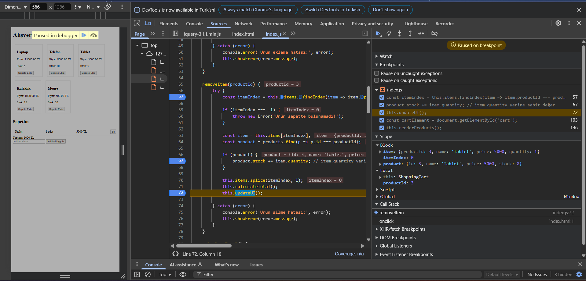
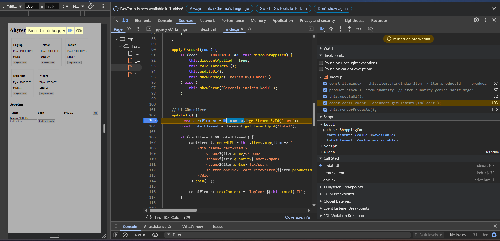

#### Çözüm
`removeItem` fonksiyonunun sonuna, diğer işlemlerden sonra `document.dispatchEvent(new Event('stockUpdate'));` satırını ekledim. Bu özel event, App sınıfındaki event listener'ı tetikleyerek ürün listesinin yeniden render edilmesini sağladı. Bu değişiklik sonrasında, sepetten ürün sildiğimde stoğa iade edilen ürünler hemen kullanıcı arayüzünde de görünür hale geldi.

```javascript
// Eklenen kod satırı
document.dispatchEvent(new Event('stockUpdate'));
```

### 4.5. Toplam Hesaplama Hatası (`calculateTotal` fonksiyonu)

#### Problem
Sepete eklenen ürünlerin toplam fiyatı hesaplanırken, ürün miktarı (quantity) ile çarpım yapılmıyordu. Bu da sepete aynı üründen birden fazla eklendiğinde, toplam fiyatın yanlış hesaplanmasına neden oluyordu.

#### Tespit Süreci
1. `calculateTotal` fonksiyonuna bir breakpoint koydum
2. Sepete aynı üründen 2 adet ekledim (örneğin 2 adet Tablet)
3. `reduce` fonksiyonunun içindeki kodu adım adım çalıştırdım
4. `sum + item.price` ifadesinde `item.quantity` ile çarpım yapılmadığını tespit ettim
5. Scope panelinde `this.items` dizisindeki ürünlerin quantity değerlerinin doğru olduğunu, ancak toplam hesaplanırken bu değerlerin kullanılmadığını gördüm

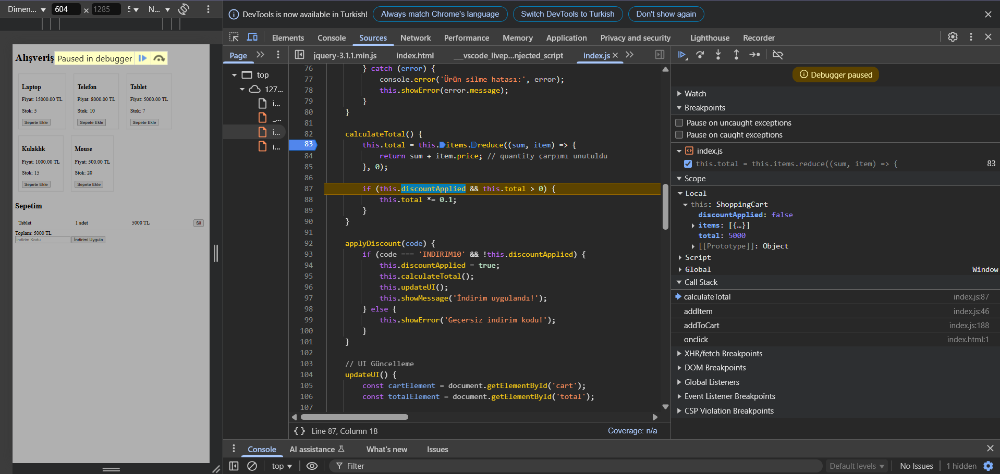
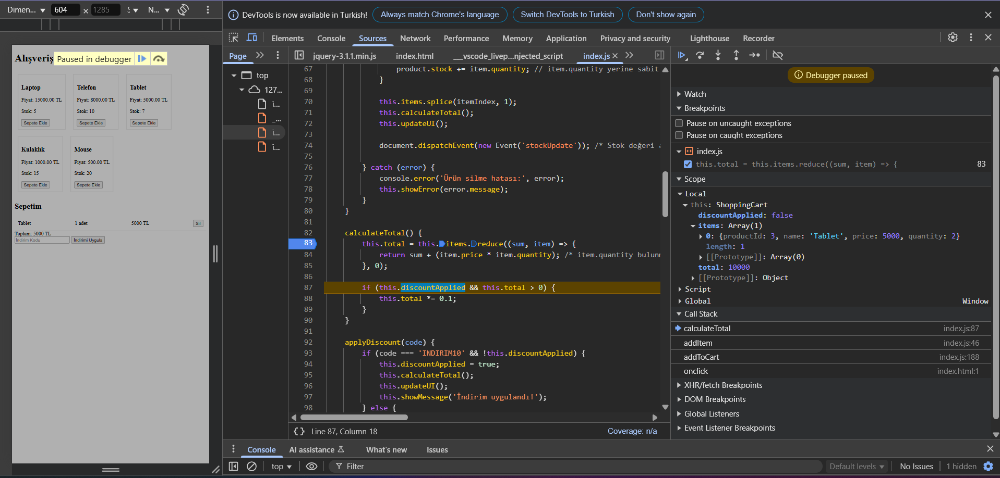

#### Çözüm
`reduce` fonksiyonundaki hesaplamayı `sum + (item.price * item.quantity)` olarak düzelttim. Böylece her ürünün kendi fiyatı ile miktarının çarpımı toplanarak doğru toplam elde edildi. Bu değişiklik sonrasında, sepete birden fazla aynı ürün eklendiğinde toplam fiyat doğru hesaplanmaya başladı. Örneğin sepette 2 adet Tablet olduğunda toplam fiyat 10000 TL (5000 TL x 2) olarak hesaplanıyor.

```javascript
// Hatalı kod
this.total = this.items.reduce((sum, item) => {
    return sum + item.price;
}, 0);

// Düzeltilmiş kod
this.total = this.items.reduce((sum, item) => {
    return sum + (item.price * item.quantity);
}, 0);
```

### 4.6. İndirim Hesaplama Hatası (`calculateTotal` fonksiyonu)

#### Problem
İndirim uygulandığında toplam fiyat `this.total *= 0.1` ile çarpılıyor, bu da toplam fiyatın %90 indirim yapılarak %10'unun alınması anlamına geliyordu. Muhtemelen burada amaç %10 indirim yapmaktı.

#### Tespit Süreci
1. İndirim kodunu uygulamadan önce toplam fiyatı not ettim (5000 TL)
2. `if (this.discountApplied && this.total > 0)` satırına bir breakpoint koydum
3. `this.total *= 0.1;` satırına bir breakpoint koydum
4. İndirim kodunu ("INDIRIM10") uygulayıp, çalışmayı izledim
5. İndirim uygulandıktan sonra toplam fiyatın 500 TL'ye düştüğünü gördüm
6. Bu, orijinal fiyatın %10'unun alındığı anlamına geliyordu (%90 indirim uygulanmış oldu)
7. Oysa kod içindeki yorum ve isim ("INDIRIM10") %10 indirim yapmak istendiğini gösteriyordu

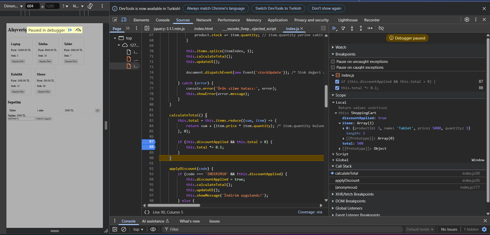
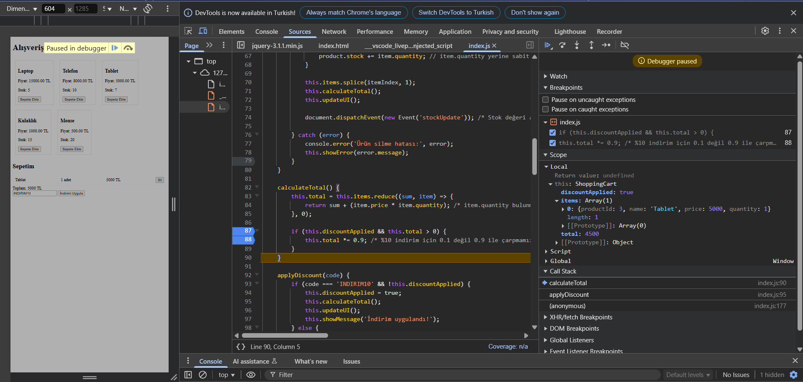

#### Çözüm
İndirim hesaplamasını `this.total *= 0.9` olarak düzelttim, böylece %10 indirim doğru şekilde uygulanır hale geldi. Bu değişiklik sonrasında, 5000 TL değerindeki bir sepete %10 indirim uygulandığında, toplam fiyat 4500 TL olarak doğru hesaplanmaya başladı.

```javascript
// Hatalı kod
this.total *= 0.1;

// Düzeltilmiş kod
this.total *= 0.9;
```

## 5. Debugging Süreci Sonucu

Yapılan debugging sürecinin ardından:
- **Stok kontrol mekanizması düzeltildi.**  
- **Ürün ekleme ve silme işlemleri artık stokları doğru şekilde güncelliyor.**  
- **UI güncellemesi hatasız hale getirildi.**  
- **Toplam hesaplamada miktarlar doğru şekilde dikkate alınıyor.**  
- **İndirim mekanizması %10'u doğru hesaplayacak şekilde düzeltildi.**  

Debugging süreci tamamlandıktan sonra uygulama beklenen şekilde çalışıyor.